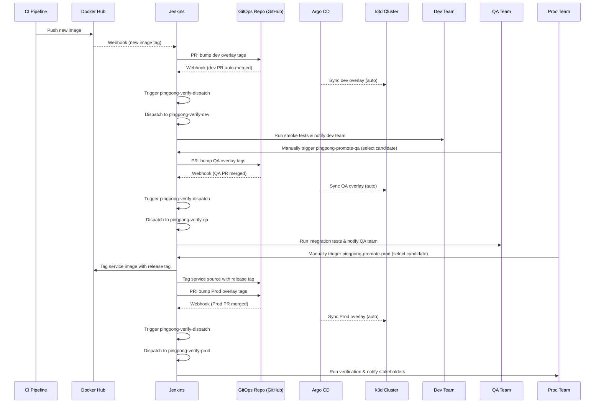

# pingpong-cicd

Continuous Delivery (CD) pipelines and scripts for the ping/pong demo. This repo provides Jenkins Pipelines that promote images across environments using a GitOps flow.

## Overview

- CI builds and publishes images to Docker Hub.
- Docker Hub webhooks trigger Jenkins to promote new images to the dev environment by opening a PR in the GitOps repo.
- GitHub auto-merges the PR for dev, then sends a webhook to Jenkins.
- Argo CD automatically syncs the new image for dev on the k3d cluster.
- Jenkins verifies the deployment in dev and notifies the dev team.
- QA and Prod promotions are manual, following the same PR-based GitOps flow.

## High-Level Flow

## Jenkins Jobs

- `pingpong-promotion-dev` (auto):
  - Trigger: Docker Hub webhook for new image.
  - Jenkinsfile: `Jenkinsfiles/promotion/dev/Jenkinsfile`.
  - Action: Opens PR to update dev overlay in GitOps repo.

- `pingpong-verify-dev` (auto/manual):
  - Trigger: Invoked by dispatcher on GitOps push affecting dev, or run manually with `BASELINE_SHA`.
  - Jenkinsfile: `Jenkinsfiles/verify/dev/Jenkinsfile`.
  - Action: Runs smoke tests on dev and notifies dev team.

- `pingpong-promote-qa` (manual):
  - Param: `BASELINE_SHA` (the GitOps commit that passed dev tests).
  - Jenkinsfile: `Jenkinsfiles/promotion/qa/Jenkinsfile`.
  - Action: Opens PR to update QA overlay in GitOps repo.

- `pingpong-verify-qa` (auto/manual):
  - Trigger: Invoked by dispatcher on GitOps push affecting QA, or run manually with `BASELINE_SHA`.
  - Jenkinsfile: `Jenkinsfiles/verify/qa/Jenkinsfile`.
  - Action: Runs integration tests on QA and notifies QA team.

- `pingpong-promote-prod` (manual):
  - Param: `BASELINE_SHA` (the GitOps commit that passed QA tests).
  - Jenkinsfile: `Jenkinsfiles/promotion/prod/Jenkinsfile`.
  - Action: Tags image and source code with release tags and opens PR to update Prod overlay in GitOps repo.

- `pingpong-verify-prod` (auto/manual):
  - Trigger: Invoked by dispatcher on GitOps push affecting Prod, or run manually with `BASELINE_SHA`.
  - Jenkinsfile: `Jenkinsfiles/verify/prod/Jenkinsfile`.
  - Action: Runs verification on Prod and notifies stakeholders.

## GitOps + Argo CD

- Git is the source of truth for desired application state in the cluster.
- PR merges to the GitOps repo change manifests; Argo CD notices and syncs them into the k3d cluster per environment.
- Argo CD ApplicationSet defines one Application per env (dev/qa/prod), each pointing to its overlay path.

## Webhooks and Tokens

- Docker Hub → Jenkins: `${PUBLIC_URL}/generic-webhook-trigger/invoke?token=pingpong-cd-dev`
- GitHub (GitOps) → Jenkins (dispatcher): `${PUBLIC_URL}/generic-webhook-trigger/invoke?token=pingpong-cd-tests`

## Credentials (expected in Jenkins)

- `gh-pat` (Secret Text): GitHub PAT to open PRs.
- `dockerhub-creds` (Username/Password): Docker Hub credentials for optional image retagging (Prod promotion).

## Related Repositories

- GitOps config: https://github.com/daoquocquyen/pingpong-gitops-config
- Local infra (Jenkins, Argo CD, k3d, ngrok): https://github.com/daoquocquyen/simple-cd-demo-infra

## Repository Overview

This project is organized into several repositories, each serving a specific purpose:

- **ping**: Contains the source code and resources for the `app ping` service.
- **pong**: Contains the source code and resources for the `app pong` service.
- **pingpong-cicd**: Manages CI/CD pipelines and automation for the Ping Pong applications, ensuring streamlined build and deployment processes.
- **pingpong-gitops-config**: Stores GitOps configuration files, which are synchronized and managed by ArgoCD for automated and declarative application delivery.
